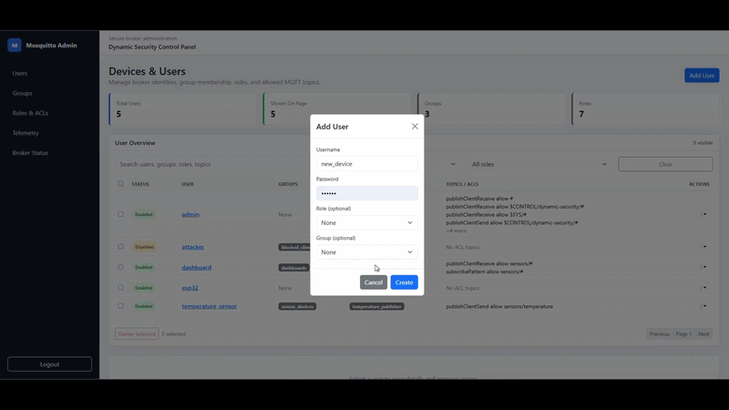
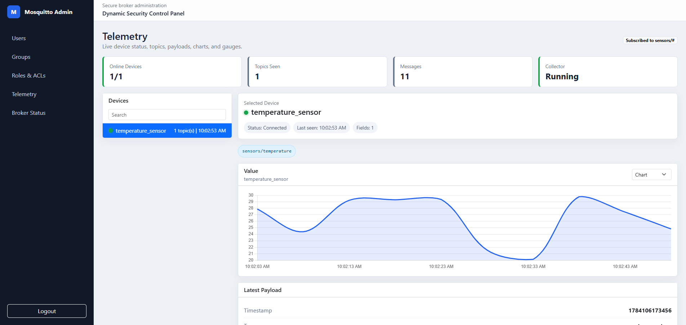

# Custom MQTT Broker Dashboard

This project packages a secure Mosquitto broker, a Flask-based administration dashboard, and MQTT telemetry tools for an IoT demo environment.

It is built to remove the need for repetitive `mosquitto_ctrl` terminal commands. Instead of managing clients, roles, groups, and ACLs by hand, you do it from a web UI that talks to the broker over TLS/mTLS. The dashboard also includes a telemetry viewer that connects as a subscriber, listens to the configured topic, and displays the data it receives in real time.

## Project Background

This project originated as an internship initiative focused on securing an IoT infrastructure built around the MQTT protocol. The original scope was organized into four phases:

1. **Broker security** — Mosquitto broker setup with the Dynamic Security plugin (clients, roles, groups, ACLs).
2. **Transport security** — a local Certificate Authority (OpenSSL) issuing X.509 certificates for TLS/mTLS between broker and clients.
3. **Simulation and testing** — Node-RED flows simulating sensors and validating connection rules (rejecting unsecured or misauthenticated clients, accepting valid ones).
4. **Hardware proof of concept** — deploying a real microcontroller (e.g. ESP32) with a physical sensor, connecting over Wi-Fi and TLS to push live data to the broker, using AWS-issued certificates.

This repository currently implements **Phases 1–3**: a secured Mosquitto broker with Dynamic Security, a local CA-based mTLS setup, a Flask dashboard for administration and telemetry, and Node-RED flows for simulation and testing. Phase 4 (physical hardware + AWS certificates) is a future extension and is not yet part of this codebase — the current telemetry and TLS setup use the **local CA**, not AWS.

## What Is Included

- `secure-mqtt-broker/` contains the Mosquitto configuration, Dynamic Security state, certificates, and Windows start/stop scripts.
- `broker-dashboard/` contains the Flask app used to manage clients, roles, groups, and telemetry views.
- `node-red/` contains the Node-RED flow used to simulate sensors and test broker connectivity.


## What The Dashboard Does

- Create, edit, disable, and delete MQTT users from the browser.
- Assign users to roles and groups without opening the command line.
- Add and remove ACL rules for publish, subscribe, and unsubscribe access.
- View broker state through a simpler UI instead of manually composing `mosquitto_ctrl` commands.
- Subscribe to live telemetry topics and render the messages that arrive on the broker.
- Show numeric telemetry fields as charts and keep recent messages available for inspection.

## Screenshots

### Client management

The client management page lets you create and maintain broker users, roles, and group membership from one place.




### Groups and roles

Groups and roles are managed directly in the dashboard, so you do not need to jump back and forth between broker commands and configuration files.


### Telemetry

The telemetry view connects as a subscriber, listens on the configured topic, and shows the payloads it receives.



### Node-RED testing

The Node-RED flow is used to validate the broker setup and test how the dashboard behaves with simulated sensor traffic.


## Quick Start

These steps are for Windows and assume Mosquitto and Python are already installed.
 must already have Flask==3.0.0 and paho-mqtt==1.6.1
1. Start the secure broker:

```powershell
cd C:\custom_mqtt_broker\secure-mqtt-broker
.\start_broker.ps1
or just click on the start_broker.bat
```

2. Start the dashboard in a second terminal:


cd C:\custom_mqtt_broker\broker-dashboard
python app.py

3. Open the dashboard in your browser:

```text
http://127.0.0.1:5000

**Default login:**
- Username: `admin`
- Password: `906271`
```

4. Log in with the local development credentials defined in `broker-dashboard/config.py`.

## How Telemetry Works

The telemetry page does not read directly from the browser. It starts a dedicated MQTT client, authenticates against the broker with TLS/mTLS, subscribes to the configured topic, and stores the most recent messages in memory so the UI can render live updates.

By default, the collector subscribes to `sensors/#`, which makes it easy to connect a sensor simulator, Node-RED flow, or a real device and immediately see the values appear in the dashboard.

## Project Structure

- `broker-dashboard/` - Flask web dashboard and telemetry collector.
- `secure-mqtt-broker/` - Secure Mosquitto config, scripts, logs, and dynamic security state.
- `certificates/` - CA and client certificates used by the broker and dashboard.
- `node-red/` - Importable Node-RED flows for simulation and testing.
- `pictures/` - Documentation screenshots and GIFs.

## Roadmap

- [ ] Phase 4: physical microcontroller PoC (ESP32 + real sensor) over Wi-Fi and TLS.
- [ ] Optional AWS IoT Core integration with AWS-issued X.509 certificates.

## Notes

- The dashboard is intended for local development and lab use.
- The secure broker listens on `8883` for TLS/mTLS connections.
- The telemetry collector expects the broker certificate chain and client certificate files referenced in `broker-dashboard/config.py`.